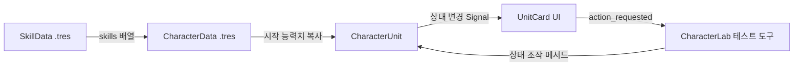

# 잿불 서약 / Oath of Embers

**현재 단계: MVP 1 · 2단계 완료.** 기본 실행 화면은 메인 메뉴이며, 새 여정으로 3 대 3 턴제 전투에 들어갑니다. 상위 폴더의 `Play-Godot.cmd`를 더블클릭하거나 `Open-Godot.ps1 -Run`으로 실행하세요. 전투 화면의 야영지 버튼으로 아래 1단계 테스트 화면에 들어갈 수 있습니다.

최신 코드 구조, 규칙, 설정 및 검증은 [2단계 개발 안내](docs/MVP1_STEP2.md)에 정리했습니다. **아래 본문은 1단계 구현 당시의 기록**이며, 다음 단계로 표시했던 턴제 전투·적·승패 판정은 현재 구현되어 있습니다. F5는 현재 전투를 시작하고, 야영지만 실행하려면 CharacterLab.tscn을 열어 F6를 누릅니다.

용의 교단이 왕국을 잠식하는 시대, 맹세로 묶인 세 모험가가 잿빛 고갯길을 넘어 교단의 심장부로 향하는 D&D풍 판타지 파티 로그라이트입니다. 이번 산출물은 **MVP 1의 1단계: 캐릭터 데이터와 상태를 직접 조작하는 실행 가능한 야영지**입니다.

기준 엔진은 **Godot 4.7.2 stable / GDScript / Compatibility 렌더러**입니다. 버전은 [Godot 공식 Windows 다운로드](https://godotengine.org/download/windows/)에서 확인했습니다. 저장소 루트에는 실행 스크립트만 두고 `godot/`를 독립 프로젝트 루트로 사용합니다. 이 문서에서 `res://`는 이 폴더입니다.

## 전체 구조와 클래스 관계

```text
godot/
├─ project.godot
├─ scenes/
│  ├─ main/CharacterLab.tscn      # 지금 실행하는 상태 테스트 화면
│  ├─ battle/CharacterUnit.tscn  # UI 없는 재사용 가능한 유닛
│  └─ ui/UnitCard.tscn           # 유닛 상태 표시
├─ scripts/
│  ├─ characters/CharacterData.gd
│  ├─ characters/CharacterUnit.gd
│  ├─ skills/SkillData.gd
│  ├─ ui/UnitCard.gd
│  └─ main/CharacterLab.gd
├─ data/
│  ├─ classes/                  # 캐릭터 시작 템플릿 3개
│  └─ skills/                   # 스킬 Resource 6개
└─ tests/test_character_system.gd
```



`CharacterData`와 `SkillData`는 여러 인스턴스가 공유하는 원본 정의입니다. `CharacterUnit`은 HP·보호막·기력과 실행 중 능력치를 각 인스턴스에 따로 보관합니다. UI는 유닛의 Signal을 구독합니다. 원본 Resource를 전투 중 수정하지 않는 것이 이 단계의 핵심 계약입니다.

향후 구조는 다음처럼 확장합니다. 아래 파일은 **예정이며 이번 단계에서 만들지 않았습니다**.

| 다음 파일/폴더 | 책임 및 연결 |
| --- | --- |
| `scripts/battle/BattleManager.gd` | 유닛 등록, 행동 처리, 승패 판정. 기존 CharacterUnit 사용 |
| `scripts/battle/TurnManager.gd` | Speed 순서와 현재 행동 유닛, 턴 Signal |
| `scripts/battle/DamageCalculator.gd` | 2d6 판정(명중·스침·치명)과 확률 계산 후 CharacterUnit에 최종 피해 전달 |
| `scripts/characters/EnemyUnit.gd`, `data/enemies/` | 공통 유닛 상태 재사용, 적 패턴 및 의도 표시 |
| `scenes/battle/BattleScene.tscn`, `scenes/ui/BattleUI.tscn` | 3 대 3 전투와 스킬/대상 선택 |
| `scripts/run/RunManager.gd` | 파티 수명, Credits, Inventory, Run 종료 관리 |
| `scripts/map/`, `scenes/map/` | 전진 전용 노드 연결, 현재 위치, 지도 화면 |
| `scripts/status/`, `data/items/`, `data/events/` | 상태 효과, 장비, 선택형 이벤트 데이터 |

새 Run에서는 시작 데이터로 유닛을 초기화합니다. 이후 맵 노드 이동에서는 RunManager가 가진 유닛 상태를 유지해야 합니다. `reset_to_starting_state()`는 야영지 테스트 또는 새 Run 생성용이며 전투마다 호출하면 안 됩니다. 현재 직업은 `class_id` 문자열로 구분하므로 새 직업을 위해 enum이나 조건문을 고칠 필요가 없습니다. 장래에 같은 직업의 여러 캐릭터가 생기면 직업 공통값을 별도 ClassData로 추출합니다.

## 1. 이번 단계의 목표

- Inspector에서 편집하는 `CharacterData`, `SkillData` Resource를 구현합니다.
- UI 없이도 실행·검증할 수 있는 `CharacterUnit`을 만듭니다.
- Rogue, Paladin, Wizard의 시작 데이터를 제공합니다.
- HP·보호막·기력, 사망, 초기화와 Signal을 검증합니다.
- 임시 Colored Rectangle과 상태 패널로 아트 없이 실행합니다.

현재는 스킬 **정의**만 구현합니다. 실제 스킬 사용, 쿨다운 감소, 방어·명중·치명타 계산, 상태 효과, 장비, 적, 턴 순서와 승패 판정은 다음 단계입니다. 화면의 버튼은 상태 테스트 도구입니다. 전열/중열/후열 정보는 저장하지만 아직 대상 제한이나 이동 효과를 적용하지 않습니다.

## 2. Scene Tree

```text
CharacterLab (Control)                    ← CharacterLab.gd
└─ Scroll (ScrollContainer)
   └─ Margin (MarginContainer)
      └─ Content (VBoxContainer)
         ├─ Eyebrow (Label)
         ├─ Header (HBoxContainer)
         │  ├─ Title (Label)
         │  └─ ResetButton (Button, unique)
         ├─ Subtitle (Label)
         ├─ Party (HBoxContainer, unique)
         │  ├─ Paladin (UnitCard instance)
         │  ├─ Rogue (UnitCard instance)
         │  └─ Wizard (UnitCard instance)
         ├─ LogTitle (Label)
         ├─ EventLog (RichTextLabel, unique)
         └─ Footer (Label)

UnitCard (PanelContainer)                 ← UnitCard.gd
├─ CharacterUnit (scene instance)
│                                         ← CharacterUnit.gd on root Node
└─ Margin (MarginContainer)
   └─ Content (VBoxContainer)
      └─ 라벨·색상 사각형·상태 바·버튼 (실행 중 생성)

CharacterUnit (Node)                      ← CharacterUnit.gd
```

UnitCard의 라벨·색상 사각형·ProgressBar·버튼은 `_ready()`에서 생성됩니다. 순수 턴제 로직에는 좌표나 물리가 필요하지 않으므로 CharacterUnit의 루트는 `Node`입니다. 이후 전투 Sprite/Node2D를 추가해도 유닛의 상태 로직을 옮길 필요가 없습니다.

## 3. 필요한 파일

| 경로 | 내용 |
| --- | --- |
| [`res://scripts/characters/CharacterData.gd`](scripts/characters/CharacterData.gd) | 정체성, 능력치, 스킬 배열 및 유효성 검사 |
| [`res://scripts/skills/SkillData.gd`](scripts/skills/SkillData.gd) | 대상/피해/효과 enum, 배율, 다단 히트, 비용, 쿨다운, 아이콘·애니메이션·사운드 정의 |
| [`res://scripts/characters/CharacterUnit.gd`](scripts/characters/CharacterUnit.gd) | 개별 상태, 피해·회복·자원 API, 사망 Signal |
| [`res://scenes/battle/CharacterUnit.tscn`](scenes/battle/CharacterUnit.tscn) | CharacterUnit 스크립트가 연결된 Node |
| [`res://scripts/ui/UnitCard.gd`](scripts/ui/UnitCard.gd), [`res://scenes/ui/UnitCard.tscn`](scenes/ui/UnitCard.tscn) | UI와 테스트 요청 Signal |
| [`res://scripts/main/CharacterLab.gd`](scripts/main/CharacterLab.gd), [`res://scenes/main/CharacterLab.tscn`](scenes/main/CharacterLab.tscn) | 야영지, 테스트 버튼 처리, 상태 로그 |
| [`res://data/classes/rogue.tres`](data/classes/rogue.tres) | 시엔 (Rogue) / HP 8, 보호막 1, 기력 5 |
| [`res://data/classes/paladin.tres`](data/classes/paladin.tres) | 알데릭 (Paladin) / HP 10, 보호막 2, 기력 5 |
| [`res://data/classes/wizard.tres`](data/classes/wizard.tres) | 엘로웬 (Wizard) / HP 6, 보호막 0, 기력 6 |
| `res://data/skills/*.tres` | 단검 베기, 급소 찌르기, 화염 화살, 마법 화살, 심판의 일격, 신앙의 방패 |
| [`res://tests/test_character_system.gd`](tests/test_character_system.gd) | 독립 상태·경계값·사망·Scene/UI 통합 검증 |

## 4. 코드

위 링크의 `.gd`, `.tscn`, `.tres`는 모두 프로젝트에 작성된 **생략 없는 실행 가능한 전체 소스**입니다. 복사해서 연결하는 추가 작업 없이 바로 실행할 수 있습니다. 구현 경계를 빠르게 읽으려면 `SkillData.gd` → `CharacterData.gd` → `CharacterUnit.gd` → `UnitCard.gd` 순서를 권장합니다.

`CharacterUnit`의 공개 API 계약:

| 메서드 | 동작/반환 |
| --- | --- |
| `initialize(definition)` | 유효하면 시작 상태로 초기화하고 true. null/잘못된 정의는 기존 상태를 유지하고 false |
| `is_alive()` | 초기화되었고 HP가 0보다 큰지 확인 |
| `receive_damage(amount, bypass_shield=false)` | 보호막 → HP 순서로 차감. 실제 HP 감소량 반환 |
| `heal(amount)` | 최대 HP까지만 회복, 실제 회복량 반환. 사망 유닛은 부활하지 않음 |
| `add_shield(amount)` | 생존 유닛에 양수 보호막 추가, 추가량 반환 |
| `can_spend_energy(amount)` | 생존·음수 비용 방지·잔량 확인 |
| `spend_energy(amount)` | 비용이 충분할 때만 지불, 성공 여부 반환 |
| `restore_energy(amount)` | 최대 기력까지 복구, 실제 복구량 반환 |
| `reset_to_starting_state()` | 원본 Resource의 시작 상태로 명시적 초기화 |

`receive_damage()` 입력은 이미 계산된 최종 피해입니다. 따라서 야영지의 피해 3 버튼은 방어를 적용하지 않습니다. 방어 계산을 유닛과 DamageCalculator 양쪽에서 중복하지 않도록 이 계약을 유지합니다. `bypass_shield`는 별도 옵션이며 TRUE_DAMAGE의 보호막 상호작용은 다음 전투 단계에서 규칙을 확정합니다.

Signal은 `initialized`, `health_changed(current, maximum)`, `shield_changed(current)`, `energy_changed(current, maximum)`, `damage_received(health_damage, shield_damage)`, `unit_died(unit)`입니다. 피해 처리 시 상태 차감을 끝낸 뒤 보호막 → HP → 피해 → 사망 순서로 발생하며, HP/보호막은 실제 변화가 있을 때만 알립니다. 초기화는 모든 표시값을 다시 알립니다. 이미 사망한 유닛에 추가 피해를 주어도 사망 Signal을 반복하지 않습니다. 유닛 삭제와 전투 종료는 향후 BattleManager가 결정합니다.

SkillData의 `attack_multiplier * 공격력 + flat_value`는 1회 효과량의 정의입니다. `hit_count`는 반복 횟수, `energy_cost`는 스킬 한 번의 비용입니다. SHIELD는 보호막 효과량으로 해석할 예정입니다. 현재 UI는 값과 설명을 읽을 뿐 실제 효과를 실행하지 않습니다. 새 효과 종류나 상태 시스템은 다음 단계에서 명시적인 처리 로직을 추가합니다.

## 5. Godot Editor 설정

1. 프로젝트 관리자에서 이 폴더의 `project.godot`를 Import합니다. 또는 상위 폴더에서 `./Open-Godot.ps1`을 실행합니다.
2. 파일 스캔과 전역 클래스 등록이 끝날 때까지 기다립니다.
3. **F6**으로 `scenes/main/CharacterLab.tscn`을 실행하거나 **F5**로 프로젝트를 실행합니다. Main Scene은 이미 지정되어 있습니다.
4. `CharacterLab.tscn`의 Party 아래 각 UnitCard에 아래 값이 연결되어 있습니다. 수동 연결은 필요 없습니다.

| UnitCard 인스턴스 | Character Data | Formation Slot |
| --- | --- | --- |
| Paladin | `res://data/classes/paladin.tres` | FRONT |
| Rogue | `res://data/classes/rogue.tres` | MIDDLE |
| Wizard | `res://data/classes/wizard.tres` | BACK |

UnitCard가 자식 CharacterUnit에 데이터를 전달하므로 **이 야영지에서는 자식의 Character Data를 따로 지정하지 않습니다**. CharacterUnit.tscn을 다른 씬에서 직접 사용할 경우 해당 루트 Node의 Character Data를 지정하면 `_ready()`가 초기화합니다. 코드로 생성할 때는 `initialize(definition)`의 반환값을 확인합니다.

새 스킬은 FileSystem의 New Resource → SkillData로 `.tres`를 생성하고 고유 ID·효과량·대상·비용 등을 설정합니다. CharacterData의 Skills 배열에 드래그하면 UI에 표시됩니다. 캐릭터를 추가할 때도 New Resource → CharacterData로 만들고 고유 ID와 Class ID를 지정합니다. 같은 유닛의 스킬 ID는 중복하지 않습니다. 숫자 enum은 Inspector에서 선택하고 기존 enum의 순서는 바꾸지 않습니다.

Godot 4.x에서 생성한 `.gd.uid`는 소스와 함께 보관하고 `.godot/` 캐시는 Git에서 제외합니다. Autoload, 외부 플러그인, 별도 이미지 파일은 필요 없습니다.

## 6. 실행했을 때 기대되는 결과

1280 × 920 야영지에 알데릭·시엔·엘로웬의 직업, 배치, 능력치, HP, 보호막, 기력, 두 개의 스킬이 표시됩니다. 스킬 위에 마우스를 올리면 설명과 대상 유형을 볼 수 있습니다. 테스트 버튼으로 상태가 바뀌고 하단 로그에 결과가 기록됩니다. 치명상을 누르면 해당 모험가의 버튼이 비활성화되고 긴 휴식으로 시작 상태를 복구합니다. 작은 창에서는 스크롤로 내용을 볼 수 있습니다.

## 7. 테스트 방법

상위 `game` 폴더 PowerShell에서 실행합니다.

```powershell
./Open-Godot.ps1 -Run
./Open-Godot.ps1 -Test
```

다른 PC에서는 `./Open-Godot.ps1 -GodotPath 'C:\Tools\Godot\Godot.exe' -Test`처럼 엔진 위치를 지정하거나 `GODOT_BIN` 환경변수에 실행 파일 절대 경로를 넣습니다. 실행 스크립트는 로컬 Godot 4.7.2 경로, PATH의 godot/godot4도 확인합니다.

자동 테스트는 **45개 검증**을 수행합니다. 동일 Resource를 공유하는 인스턴스의 독립성, 보호막 초과 피해, 최대치, 음수 입력, 기력 부족, 한 번만 발생하는 사망 Signal, 재초기화, 유효하지 않은 입력의 원자성, 세 데이터 파일, 실제 버튼 → 모델 → UI 흐름을 포함합니다.

수동으로는 다음을 확인합니다.

1. 시엔의 피해 3: 보호막 1 → 0, HP 8 → 6. 다른 두 캐릭터는 변화가 없습니다.
2. 시엔 치유 25: HP가 100에서 멈춥니다.
3. 기력 −2를 반복: 부족하면 기력이 음수가 되지 않고 실패 로그가 나옵니다.
4. 보호막 +20 다음 피해 30: 보호막부터 소모됩니다.
5. 치명상: HP 0, 조작 비활성화, 사망 Signal 로그가 한 번 발생합니다.
6. 긴 휴식: 각 캐릭터의 HP·보호막·기력이 원래 값으로 복구됩니다.

렌더러까지 검증하려면 일반 Godot 프로세스에서 다음을 실행합니다. `--capture`는 `--headless`와 함께 사용하지 않습니다.

```powershell
& 'C:\Tools\Godot\Godot.exe' --path .\godot --script res://tests/test_character_system.gd -- --capture
```

이 모드는 스크린샷 저장 검증을 더해 46개를 확인하고 종료합니다. 결과는 `res://test-output/character-lab.png`에 저장되며 Git에서 제외됩니다. 실제 Godot 4.7.2에서 headless 테스트와 OpenGL 렌더링 테스트가 모두 통과했습니다.

## 8. 발생할 가능성이 높은 오류

| 현상 | 확인할 내용 |
| --- | --- |
| `CharacterData`/`SkillData`를 찾지 못함 | 프로젝트를 Editor로 한 번 가져오거나 `--headless --editor --import`로 전역 클래스 캐시 생성 |
| Godot 실행 파일을 찾을 수 없음 | `-GodotPath` 또는 `GODOT_BIN`에 현재 엔진 경로 지정 |
| 카드에 CharacterData 확인 메시지 | UnitCard의 Resource 연결, 양수 Max HP, 고유 ID, 비어 있지 않은 Skills 슬롯 확인 |
| `%Party`, `%EventLog` 노드 오류 | 원래 노드 이름과 Unique Name in Owner 설정 유지 |
| Skill이 클릭되지 않음 | 이번 단계는 정의 표시만 구현. 실제 스킬/대상 선택은 다음 단계 |
| 캐릭터 사망 후 회복 불가 | 의도된 규칙. 야영지에서는 긴 휴식 사용 |
| 한글 글꼴이 다르게 보임 | Windows 맑은 고딕 사용. 다른 OS에서는 Noto Sans CJK KR 또는 시스템 대체 글꼴 사용 |
| 야영지 피해와 ATK/DEF 수치가 다름 | 테스트는 최종 피해를 직접 주입. 공격력·방어력 계산은 다음 단계 |

## 9. 다음 단계

다음 단계는 **MVP 1 · 2단계: 실제 3 대 3 턴제 전투**입니다. EnemyUnit과 적 데이터, TurnManager의 Speed 기반 순서, BattleManager의 행동 상태, DamageCalculator, BattleScene을 추가합니다. 플레이어는 스킬 → 대상 순서로 선택하고 사망 유닛은 행동 큐에서 제외하며, 적 전멸/파티 전멸로 승패를 판정합니다. 이후 전투를 충분히 검증한 뒤 선형 맵 → 무작위 맵 → 보상/장비/상태 효과 → 다양한 적과 보스로 진행합니다.
